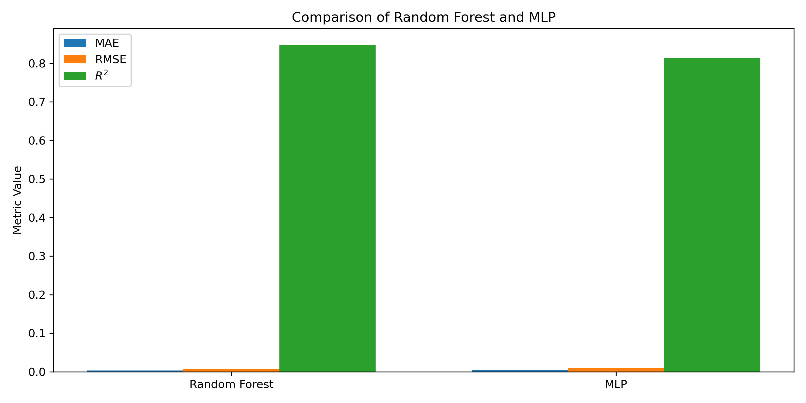
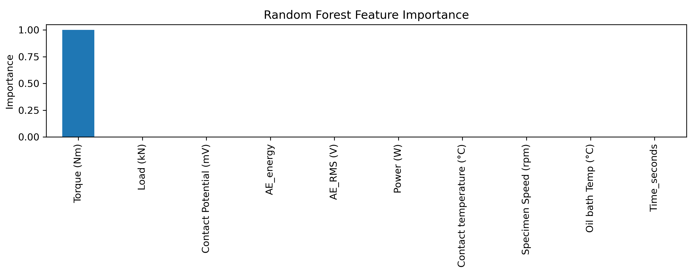
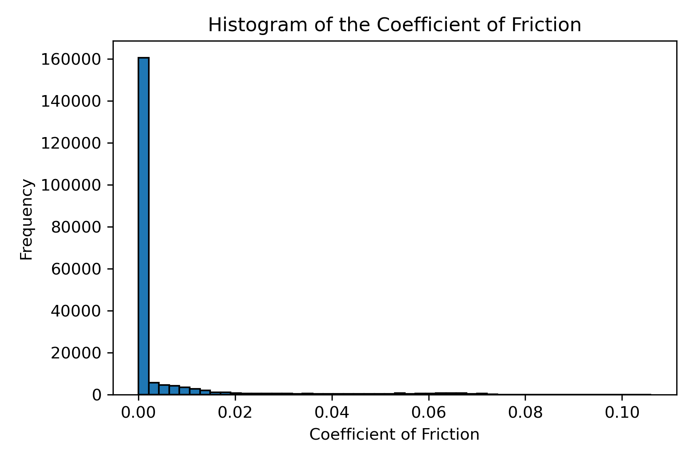

###Data availability
The data folder is not included in the link repository due to GitHub file size limitations. It can be accessed at the following link: https://drive.google.com/drive/folders/1hJuIa22borVOM2XFSwqAo4mLoxQkP54E?usp=sharing

###Project Title

Predictive Maintenance of Journal Bearing Shells Using Machine Learning

###Abstract

This project investigates tribological data obtained from journal bearing start–stop experiments with the aim of supporting predictive maintenance. Time-series sensor data including torque, rotational speed, temperature, load, and acoustic emission signals were preprocessed and analyzed using machine learning techniques. Multiple regression models were trained to predict the coefficient of friction under varying operating conditions. The results demonstrate that ensemble-based methods, particularly Random Forests, provide accurate and robust predictions compared to neural network approaches.

### Introduction

**Background**

Journal bearings are widely used in mechanical systems due to their ability to support high loads with low friction. However, during repeated start–stop operations, bearings often operate under mixed or boundary lubrication regimes, which increases friction and accelerates wear. These conditions can lead to unexpected failures if degradation is not detected early. Therefore, monitoring friction-related parameters and understanding their evolution during operation is essential for the development of predictive maintenance strategies and improved bearing reliability.

**Objectives**

The main objectives of this project are:
- To preprocess and analyze tribological time-series data from journal bearing experiments
- To compute and evaluate relevant physical features related to friction behavior
- To apply and compare different machine learning regression models for predicting the coefficient of friction
- To assess model performance using appropriate statistical metrics and visualizations

## Methods

**Data Acquisition**

The dataset used in this project was provided for educational purposes by Montanuniversität Leoben and originates from Journal Bearing Adapter (JBA) experiments. The measurements were recorded during repeated start–stop cycles of a lubricated journal bearing system. The dataset consists of time-series sensor data sampled primarily at 10 Hz and includes variables such as friction torque, rotational speed, normal load, oil bath temperature, contact potential, and acoustic emission RMS values.

**Data Analysis**

The raw sensor data was preprocessed by handling missing values, removing non-physical measurements, and normalizing numerical features. Additional tribological features such as friction power and acoustic emission energy were computed to enhance the representation of friction behavior. The dataset was then split into training, validation, and test sets using a time-aware strategy to avoid information leakage.

Machine learning regression models were trained to predict the coefficient of friction based on the available sensor inputs. A Random Forest regressor and a Multi-Layer Perceptron (MLP) were implemented and evaluated. Model performance was assessed using standard regression metrics, including root mean square error (RMSE), mean absolute error (MAE), and the coefficient of determination (R²).

**Tools Used**

The following tools and libraries were used in this project:
- Python for data processing and model development
- pandas and numpy for data manipulation and numerical computations
- scikit-learn for machine learning models and evaluation
- matplotlib and seaborn for data visualization
- Jupyter Notebook for interactive development and analysis

## Results

**Findings**

The Random Forest regression model achieved very high predictive accuracy for the coefficient of friction, with low RMSE and MAE values and R² scores close to one on both validation and test datasets. This indicates that the model can reliably capture the relationship between the measured sensor inputs and friction behavior. 

In contrast, the Multi-Layer Perceptron (MLP) regressor showed good performance on the validation set but significantly reduced generalization capability on the test set, resulting in larger prediction errors and negative R² values. This suggests that the neural network model is more sensitive to distribution shifts and less robust for this particular dataset.

**Visualizations**

| Model          | RMSE (Test) | MAE (Test)  |  R² (Test)|
|----------------|-------------|------------ |-----------|
| Random Forest  | 1.20 × 10⁻⁴ | 3.17 × 10⁻⁵ | 0.99997   |
| MLP Regressor  | 4.82 × 10⁻² | 1.49 × 10⁻² | −4.07     |

*Figure 1: Comparison of Random Forest and MLP regression models on the test set using RMSE, MAE, and R² metrics. The Random Forest model significantly outperforms the MLP regressor.*

*Figure 2: Predicted versus actual coefficient of friction values for the Random Forest model. The strong alignment along the diagonal indicates excellent predictive accuracy.*

*Figure 3: Feature importance obtained from the Random Forest model. Torque is identified as the dominant feature, which is consistent with the physical definition of the coefficient of friction.*

*Figure 4: Histogram of the coefficient of friction showing the distribution of the target variable used for regression.*

## Conclusion

In this project, a complete machine learning pipeline was developed to analyze tribological data from journal bearing start–stop experiments. After preprocessing the data and engineering physically meaningful features, multiple regression models were trained and compared. The Random Forest model achieved excellent predictive performance for the coefficient of friction, significantly outperforming the MLP regressor. These results demonstrate that ensemble-based machine learning methods are well suited for modeling complex friction-related phenomena and can support predictive maintenance applications. Future work could include modeling wear directly when more informative wear measurements are available and extending the analysis to sequence-based models such as LSTM networks.

## License

The dataset used in this project was provided for educational and research purposes by the Chair of Automation and Measurement, Montanuniversität Leoben. The data is used exclusively for academic coursework and is not redistributed.

## Acknowledgments

The author would like to thank the Chair of The Chair of Cyber-Physical-Systems at Montanuniversität Leoben for providing the Journal Bearing Adapter (JBA) dataset and experimental background material. This project was developed as part of the Applied Machine and Deep Learning course. ChatGPT was used as a support tool for code structuring, debugging, and improving the clarity of the written explanations.

